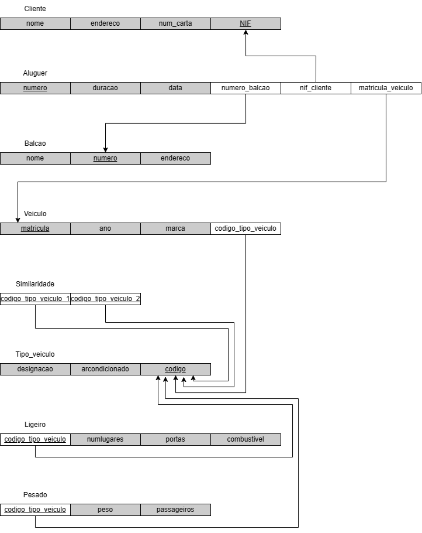
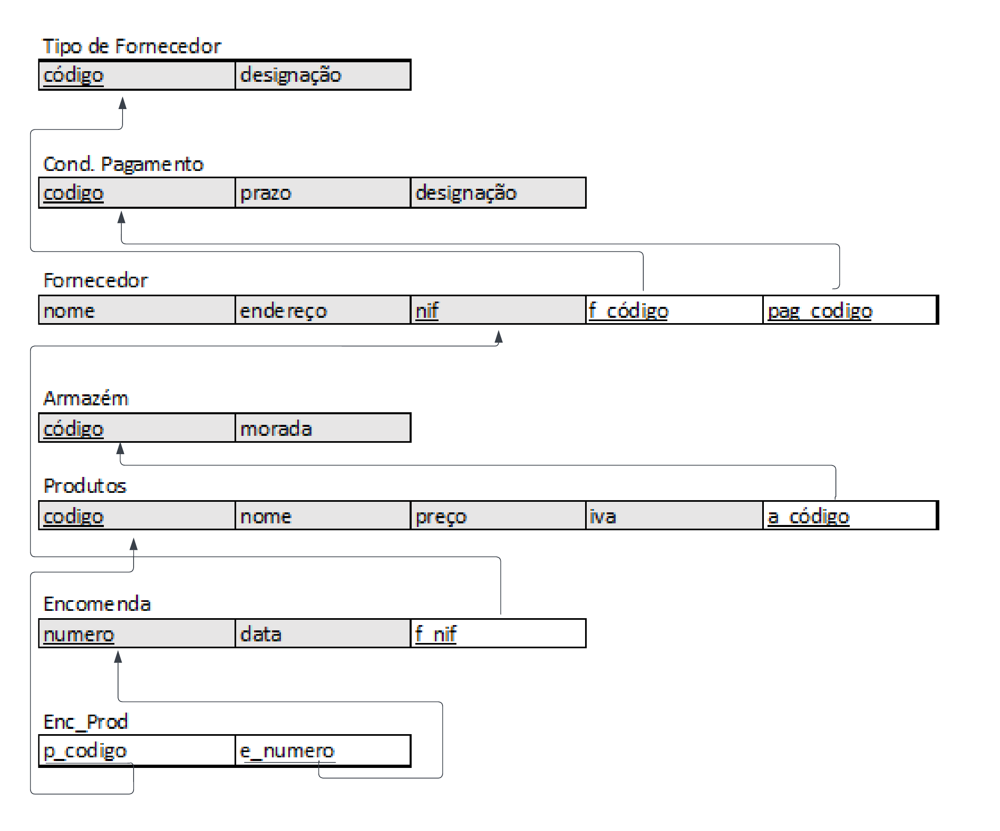
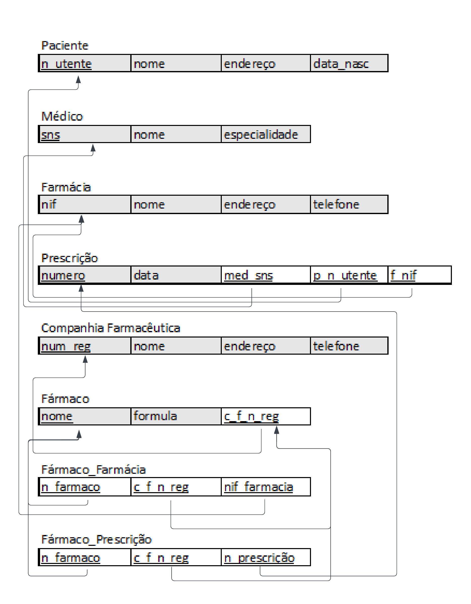
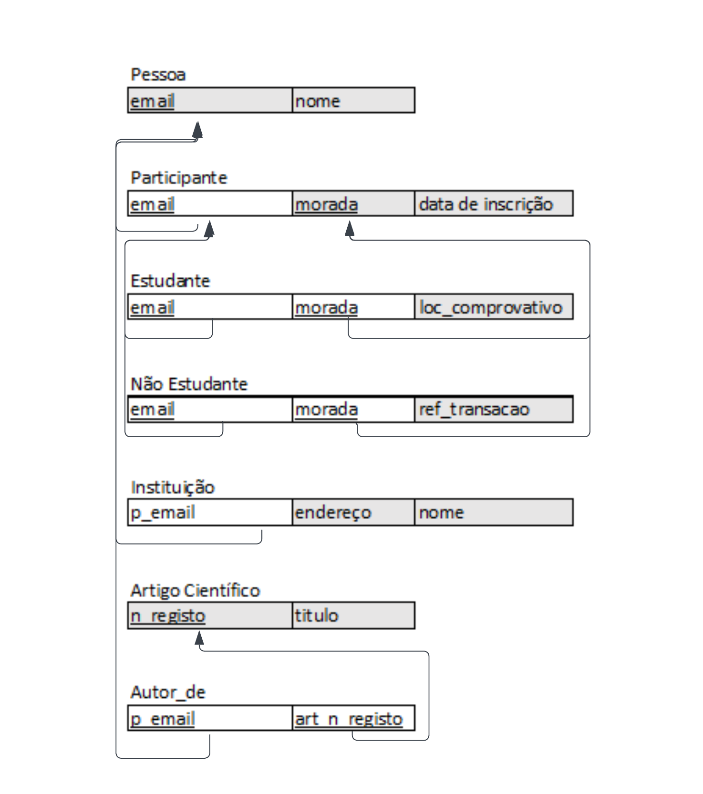
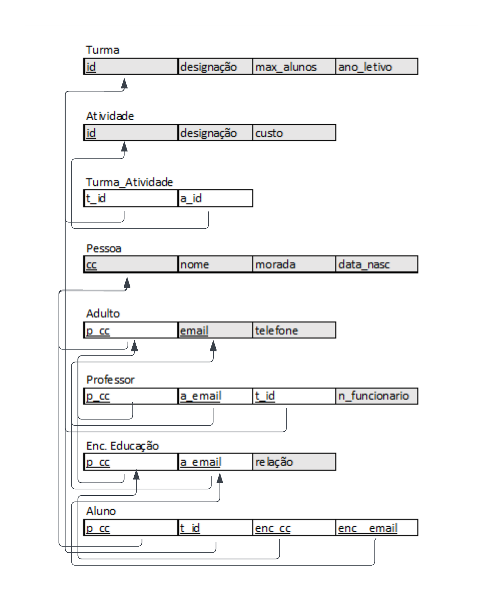

# BD: Guião 3


## ​Problema 3.1
 
### *a)*

```
Cliente(nome, endereco, num_carta, NIF)
Aluguer(numero, duracao, data, numero_balcao, nif_cliente, matricula_veiculo)
Balcao(nome, numero, endereco)
Veiculo(matricula, ano, marca, codigo_tipo_veiculo)
Similaridade(codigo_tipo_veiculo_1, codigo_tipo_veiculo_2)
Tipo_veiculo(designacao, arcondicionado, codigo)
Ligeiro(codigo_tipo_veiculo, numlugares, portas, combustivel)
Pesado(codigo_tipo_veiculo, peso, passageiros)
```


### *b)* 

```
Cliente
CK: NIF, num_carta; PK: NIF; FK: -

Aluguer:
CK: numero; PK: numero; FK: numero_balcao, nif_cliente, matricula_veiculo

Balcao:
CK: numero; PK: numero; FK: -

Veiculo:
CK: matricula; PK: matricula; FK: codigo_tipo_veiculo

Tipo_veiculo:
CK: codigo; PK: codigo; FK: -

Similaridade:
CK: codigo_tipo_veiculo_1, codigo_tipo_veiculo_2; PK: codigo_tipo_veiculo_1, codigo_tipo_veiculo_2; FK: codigo_tipo_veiculo_1, codigo_tipo_veiculo_2

Ligeiro:
CK: codigo_tipo_veiculo; PK: codigo_tipo_veiculo; FK: codigo_tipo_veiculo

Pesado:
CK: codigo_tipo_veiculo; PK: codigo_tipo_veiculo; FK: codigo_tipo_veiculo
```


### *c)* 




## ​Problema 3.2

### *a)*

```
Flight(number, airline, weekdays)
Fare(f_number, code, restrictions, amount)
Airplane_type(type_name, max_seats, company)
Airplane(a_type_name, airplane_id, total_no_of_seats)
Airport(airport_code, city, state, name)
Flight_leg(a_code_1, a_code_2, f_number, leg_no, scheduled_dep_time, scheduled_arr_time)
Leg_instance(a_code_1, a_code_2, f_number, f_leg_no, a_id, date, no_of_avail_seats)
Seat(a_code_1, a_code_2, f_number, f_leg_no, a_id, leg_i_date, seat_no, customer_name)
Can_land(airport_code, type_name)
```


### *b)* 

```
Flight:
CK: number; PK: number; FK: -

Fare:
CK: code; PK: code; FK: f_number

Airplane_type:
CK: type_name; PK: type_name; FK: -

Airplane:
CK: airplane_id; PK: airplane_id; FK: a_type_name

Airport
CK: airport_code, name; PK: airport_code; FK: -

Flight_leg:
CK: leg_no; PK: leg_no; FK: a_code_1, a_code2, f_number

Leg_instance:
CK: date; PK: date, codigo_tipo_veiculo_2; FK: a_code_1, a_code_2, f_number, f_leg_no, a_id

Seat:
CK: seat_no; PK: seat_no; FK: a_code_1, a_code_2, f_number, f_leg_no, a_id

Can_land:
CK: airport_code, type_name; PK: airport_code, type_name; FK: airport_code, type_name
```


### *c)* 


## ​Problema 3.3


### *a)* 2.1



### *b)* 2.2



### *c)* 2.3



### *d)* 2.4

